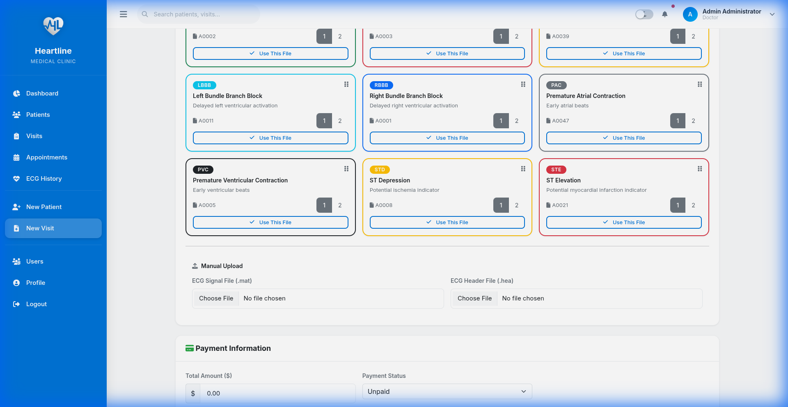
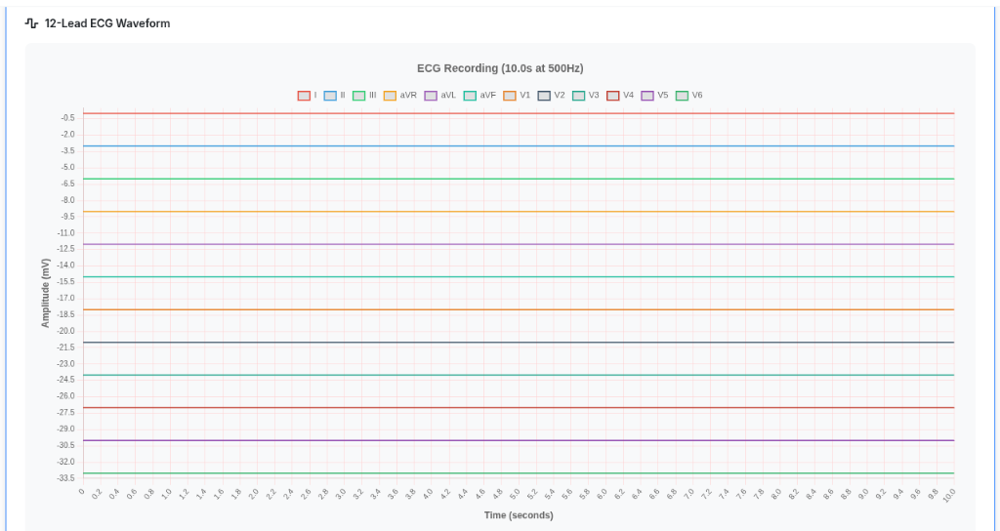

# 🏥 Heartline - AI-Powered Cardiology Management System

<div align="center">


**A comprehensive medical management platform with AI-powered ECG analysis for cardiology practices**

[Features](#-features) • [Installation](#-installation) • [Usage](#-usage) • [API](#-api-endpoints) • [License](#-license)

</div>

---

## 🎯 Overview

Heartline is a full-featured cardiology practice management system that combines traditional patient/visit management with cutting-edge AI-powered ECG analysis. Built specifically for the Algerian healthcare market, it includes a database of 7000+ local medications.

### Key Highlights

- **🧠 AI ECG Analysis**: ResNet34 deep learning model for 9-class cardiac condition detection
- **💊 7000+ Algerian Medications**: Complete pharmaceutical database with autocomplete search
- **👥 Patient Management**: Full patient lifecycle from registration to follow-up
- **📅 Appointment System**: Scheduling, queue management, and visit tracking
- **🔐 Role-Based Access**: Doctor and assistant role separation
- **📊 Real-time Analytics**: Dashboard with clinical insights

---

## 🧠 AI ECG Analysis System

### Supported Cardiac Conditions

| Abbreviation | Condition | Description |
|:------------:|-----------|-------------|
| **SNR** | Sinus Rhythm | Normal heart rhythm |
| **AF** | Atrial Fibrillation | Irregular heart rhythm |
| **IAVB** | AV Block | Atrioventricular conduction block |
| **LBBB** | Left Bundle Branch Block | Left ventricular conduction delay |
| **RBBB** | Right Bundle Branch Block | Right ventricular conduction delay |
| **PAC** | Premature Atrial Contraction | Early atrial heartbeat |
| **PVC** | Premature Ventricular Contraction | Early ventricular heartbeat |
| **STD** | ST Depression | Possible ischemia indicator |
| **STE** | ST Elevation | Possible infarction indicator |

### Technical Specifications

- **Architecture**: ResNet34 Convolutional Neural Network
- **Runtime**: ONNX Runtime (47MB, 95% smaller than PyTorch)
- **Input**: 12-lead ECG files (.mat + .hea format, PhysioNet compatible)
- **Output**: Probability distribution across 9 classes with confidence scores
- **Inference Speed**: < 1 second per ECG

---

## ✨ Features

### Patient Management
- Complete demographic and medical history tracking
- Advanced search with filters (age, gender, visit history, payment status)
- Patient profile with visit history and ECG records

### Visit Management
- Comprehensive visit documentation
- ECG file upload and automatic AI analysis
- Prescription management with medication search
- Document attachments (blood work, MRI, X-ray scans)
- Payment tracking (paid/partial/unpaid)

### Prescription System
- 7000+ Algerian medications database
- Autocomplete search with dosage information
- Multi-prescription support per visit
- Dosage instructions and quantity tracking

### ECG History
- Complete ECG analysis history
- Filter by patient, date, diagnosis, confidence
- Export to CSV for research
- Detailed probability breakdowns

### Appointment Scheduling
- Patient appointment management
- Doctor assignment
- Status tracking (scheduled/completed/cancelled)
- Queue management for daily flow

### Dashboard & Analytics
- **Doctor Dashboard**: Patient metrics, ECG trends, daily schedule
- **Assistant Dashboard**: Registration stats, queue management
- Real-time statistics and performance insights

### Security
- Role-based access control (Doctor/Assistant)
- Secure authentication with password hashing
- Session management
- Activity logging

---

## 📸 Screenshots

### Visit Form with Demo ECG Files

The visit form features a streamlined interface for creating patient visits with integrated ECG analysis. Demo ECG files are provided for quick testing of the AI analysis system.



**Key features shown:**
- 🎯 Searchable patient selection with Tom Select  
- 📁 Demo ECG files for instant testing
- 📅 Date/time pickers for visit scheduling
- 💊 Medication autocomplete with 7000+ drugs
- 🎨 Color-coded cardiac conditions
- 🖱️ Drag-and-drop ECG file upload

### Live ECG Waveform Visualization

Real-time visualization of 12-lead ECG recordings with authentic ECG paper-style grid and color-coded leads.



**Technical details:**
- 📊 Chart.js powered visualization
- 🎨 12 distinct lead colors
- 📏 Standard ECG paper grid (0.2s × 0.5mV)
- ⚡ Optimized rendering with disabled animations
- 🔍 Interactive with zoom/pan capabilities

> **Demo Recording**: See the visit form in action → [visit_form_demo.webp](doc/screenshots/visit_form_demo.webp)

---

## 🛠 Installation

### Prerequisites

- Python 3.11+
- PostgreSQL 15+
- pip package manager

### Setup

1. **Clone the repository**
   ```bash
   git clone https://github.com/blamairia/Hearline-Webapp.git
   cd Hearline-Webapp
   ```

2. **Create virtual environment**
   ```bash
   python -m venv venv
   source venv/bin/activate  # Linux/Mac
   # or: venv\Scripts\activate  # Windows
   ```

3. **Install dependencies**
   ```bash
   pip install -r requirements.txt
   ```

4. **Configure environment**
   ```bash
   cp .env.example .env
   # Edit .env with your database credentials
   ```

5. **Initialize database**
   ```bash
   flask db upgrade
   ```

6. **Run the application**
   ```bash
   flask run
   # or: python app.py
   ```

The application will be available at `http://localhost:5000`

### Environment Variables

```env
# Database Configuration
DB_HOST=your-database-host
DB_PORT=5432
DB_USER=your-username
DB_PASSWORD=your-password
DB_NAME=heartline

# Flask Configuration
SECRET_KEY=your-secret-key
FLASK_ENV=development
```

---

## 📁 Project Structure

```
Hearline-Webapp/
├── app.py                 # Main Flask application
├── models.py              # SQLAlchemy database models
├── resnet.py              # ResNet34 model architecture
├── ecg_worker.py          # ECG processing utilities
├── resnet34_model.onnx    # Pre-trained ONNX model (47MB)
├── requirements.txt       # Python dependencies
├── forms/                 # WTForms definitions
│   └── auth_forms.py
├── templates/             # Jinja2 HTML templates
│   ├── auth/              # Login, register, profile
│   ├── dashboard/         # Doctor & assistant dashboards
│   ├── forms/             # Patient, visit, appointment forms
│   ├── tables/            # Data tables (patients, visits, ECG history)
│   ├── pages/             # Settings, other pages
│   └── base.html          # Base template
├── static/                # CSS, JavaScript, images
│   ├── css/
│   ├── js/
│   └── img/
├── doc/                   # API documentation
└── uploads/               # Uploaded ECG files (gitignored)
```

---

## 🔌 API Endpoints

### Patients
| Method | Endpoint | Description |
|--------|----------|-------------|
| GET | `/api/patients` | List patients with pagination |
| GET | `/search_patients` | AJAX patient search |
| POST | `/create_patient` | Create patient via AJAX |

### Visits
| Method | Endpoint | Description |
|--------|----------|-------------|
| GET | `/api/visits` | List visits with pagination |
| GET | `/visit/<id>` | Visit details |
| POST | `/visit/new` | Create new visit |
| POST | `/visit/<id>/edit` | Update visit |

### ECG Analysis
| Method | Endpoint | Description |
|--------|----------|-------------|
| POST | `/analyze_ecg` | Real-time ECG analysis |
| POST | `/visit/<id>/analyze_ecg` | Analyze existing ECG files |
| GET | `/visit/<id>/ecg_waveform` | Get ECG waveform data |
| GET | `/api/ecg_details/<id>` | Detailed ECG analysis |
| GET | `/ecg_history` | ECG history table |
| GET | `/ecg_history/export` | Export ECG history to CSV |

### Appointments
| Method | Endpoint | Description |
|--------|----------|-------------|
| GET | `/api/appointments` | List appointments |
| POST | `/appointment/new` | Create appointment |
| POST | `/api/appointments/<id>/update-status` | Update status |
| DELETE | `/api/appointments/<id>` | Delete appointment |

### Medications
| Method | Endpoint | Description |
|--------|----------|-------------|
| GET | `/search_medicaments` | Search medications (Select2) |

---

## 🚀 Deployment

### Azure Container Apps (Always-on demo)
Use the GitHub Actions workflow described in [`AZURE_DEPLOYMENT.md`](AZURE_DEPLOYMENT.md) to build the Docker image, push it to Azure Container Registry, and update the Container App with a managed custom domain. This keeps a single replica online at all times so the app loads immediately from your main portfolio site.

### Using Nginx + Gunicorn

1. **Install Gunicorn**
   ```bash
   pip install gunicorn
   ```

2. **Create systemd service**
   ```ini
   [Unit]
   Description=Heartline Webapp
   After=network.target

   [Service]
   User=www-data
   WorkingDirectory=/path/to/Hearline-Webapp
   ExecStart=/path/to/venv/bin/gunicorn -w 4 -b 127.0.0.1:5000 app:app
   Restart=always

   [Install]
   WantedBy=multi-user.target
   ```

3. **Nginx configuration**
   ```nginx
   server {
       listen 80;
       server_name your-domain.com;

       location / {
           proxy_pass http://127.0.0.1:5000;
           proxy_set_header Host $host;
           proxy_set_header X-Real-IP $remote_addr;
       }
   }
   ```

---

## 📊 Database Schema

### Core Models
- **Patient**: Demographics, contact, medical history
- **Doctor**: Staff information
- **Visit**: Consultations with ECG data and prescriptions
- **Appointment**: Scheduling and queue management
- **Prescription**: Medication orders linked to visits
- **Medicament**: 7000+ Algerian medications
- **User**: Authentication with role-based access

---

## 🔧 Technology Stack

| Layer | Technology |
|-------|------------|
| **Backend** | Flask 2.3, Python 3.11+ |
| **Database** | PostgreSQL 15+, SQLAlchemy |
| **AI/ML** | ONNX Runtime, ResNet34 |
| **Frontend** | Bootstrap 4, jQuery, Chart.js |
| **Auth** | Flask-Login, Flask-Bcrypt |
| **Forms** | Flask-WTF, WTForms |

---

## 📄 License

This project is proprietary software developed for Heartline.

---

## 👤 Author

**Billel Lamairia**
- GitHub: [@blamairia](https://github.com/blamairia)
- Location: Annaba, Algeria

---

<div align="center">

**Heartline** - Revolutionizing Cardiology Care with AI

*Built with ❤️ in Algeria*

</div>
